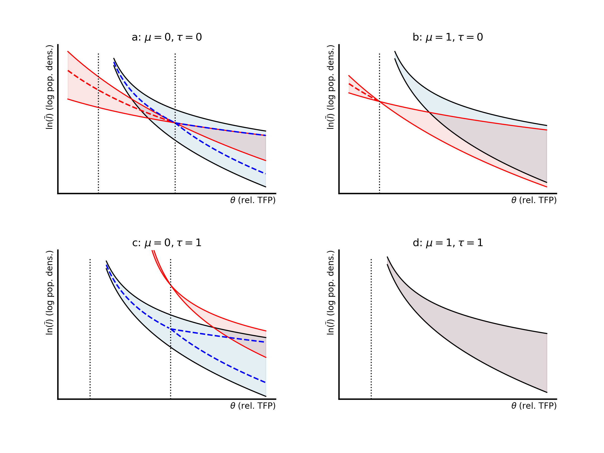

# open-enclose.github.io

Online appendix for the pape:
> Baker, Matthew J., and Jonathan H. Conning. 2026. “A Model of Enclosures: Conflict, Coordination and Efficiency in the Transformation of Property Rights.” Hunter College Department of Economics Manuscript.

- Math derivations and code to reproduce all figures, as well as interactively explore how the model responds to parameter changes.

