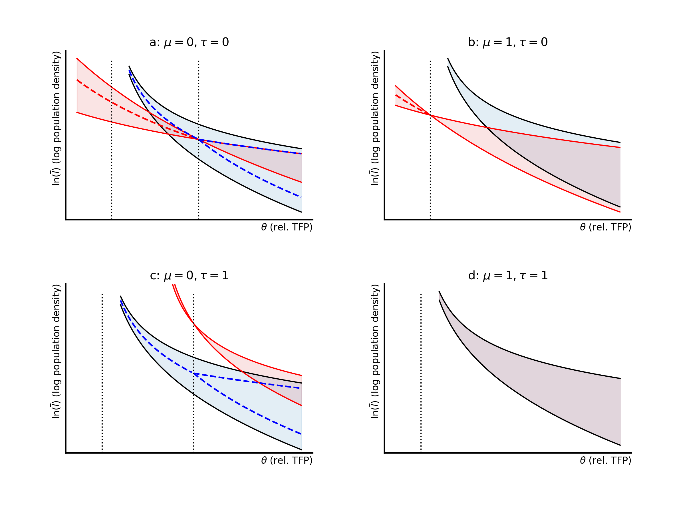

# A Model of Enclosures (appendix)

Online appendix materials for:

> Baker, Matthew J., and Jonathan H. Conning. 2026. "A Model of Enclosures: Conflict,
> Coordination and Efficiency in the Transformation of Property Rights."
> [early arXiv PDF](https://arxiv.org/abs/2311.01592) |
> [2026 revision PDF](enclosure_paper.pdf)

Complete mathematical derivations, and the code that reproduces every figure in the paper.



## Contents

- **[The Model](content/01-model.md)** — a guided walkthrough of the derivations, in the
  paper's order: how each threshold is obtained, and why the algebra collapses the way it
  does. Every section ends at a numbered equation from the paper.
- **[Reproducing the Paper's Figures](content/02-figures.md)** — each figure in one function
  call, and how to change the parameters.
- **[Manufacturing and Structural Transformation](content/03-manufacturing.md)** — a
  three-sector extension that goes beyond the published paper, including a result on when
  enclosure releases labor to industry and when it does the opposite.
- **[Mathematical Appendix](content/04-derivations.md)** — the full derivations, equation by
  equation.

## Running the code

```bash
git clone https://github.com/open-enclose/open-enclose.github.io
cd open-enclose.github.io
pip install -e ".[dev]"

python scripts/make_figures.py --outdir Figures   # regenerate every figure
pytest tests/                                      # 105 tests
```

The `enclose` package is layered so that each piece can be checked against another:

| Module | Contents |
|:---|:---|
| `enclose.model` | The economics — $\Lambda$, labor allocation, rents, wages, enclosure rates. numpy only. |
| `enclose.loci` | The boundary loci in $(\theta, \ln\bar l)$ space, tagged with paper equation numbers. |
| `enclose.symbolic` | Symbolic derivations of every locus, used to verify the numeric layer. |
| `enclose.manufacturing` | The three-sector extension. |
| `enclose.figures` | One function per figure. |

Figures are regenerated in CI on every push, immediately before the site is built, so what
is published here cannot drift from the code that produces it.
